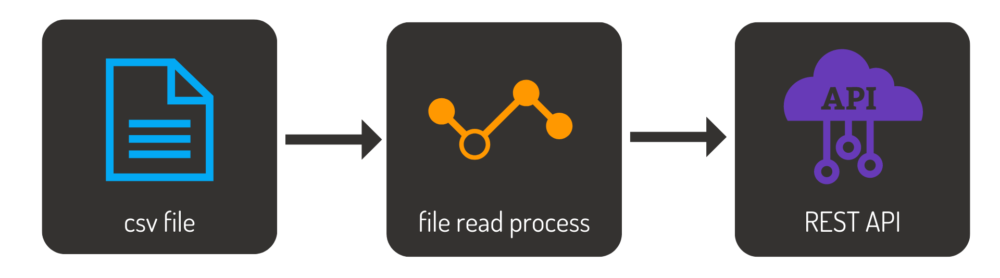

# Hands on Linx 6 - File Importer

## Description

[Linx](https://linx.software/) solution created for illistrating the Linx 6 designer. The solution has is a very simplefile reader, that reads a csv file and makes the data availalbe via a REST service. 
The below is a simple solution diagram:

The solution has:
- A custom type named Customer that will contain customer data
- A process that loads data into a list of customers
- A SimpleRESTHost that can be called to retreive the data loaded from the file

## Usage

The solution can be downloaded as is. Pleas note that the following will have to be set in order for the solution to run:
Please set the File path on the TextFileWrite component (GetCustomerData) to the file location of the downloaded csv file. 

## Contributing

For questions please ask the [Linx community](https://linx/software/community). 

## License

[MIT](https://github.com/linx-software/template-repo/blob/main/LICENSE.txt)
